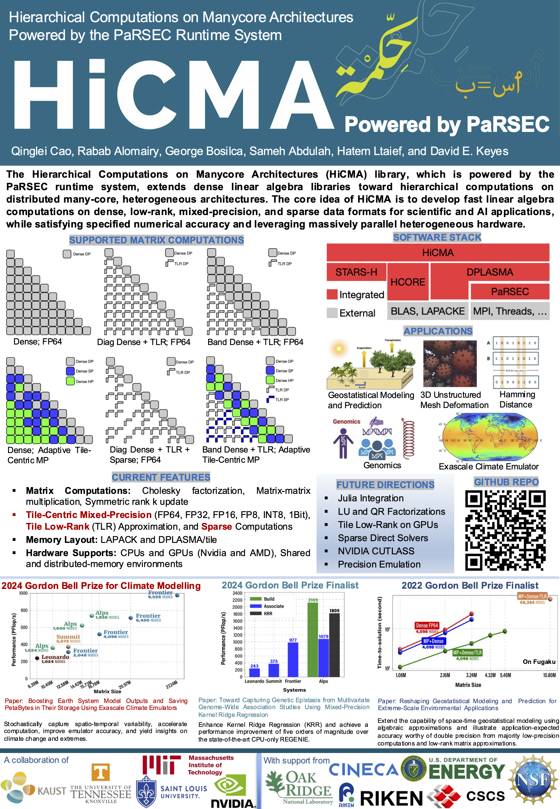

# HiCMA-PaRSEC

## Table of Contents
- [Overview](#overview)
- [Features](#features)
- [Building](#building)
- [Testing](#testing)
- [Literature](#literature)

## Overview

HiCMA-PaRSEC, i.e., Hierarchical Computations on Manycore Architectures (HiCMA) powered by Parallel Runtime Scheduler and Execution Controller (PaRSEC), combines the linear algebraic contributions of mixed-precision and low-rank computations. The framework features adaptive memory management and precision selection capabilities to optimize performance and accuracy for extreme-scale scientific computing applications.

   

## Features

### Core Computational Capabilities
- **Matrix Operations**: Matrix multiplication, Cholesky factorization, rank-k updates, etc.
- **Tile Low-Rank (TLR) Computations**: Hierarchical matrix representations for sparse problems
- **Mixed Precision Support**: Double, single, half, and FP8 precision arithmetic
- **Adaptive Memory Management**: Dynamic memory allocation and precision selection
- **GPU Acceleration**: CUDA and HIP support for heterogeneous computing

### Runtime and Parallelism
- **PaRSEC Dynamic Runtime**: Task-based parallel execution with automatic load balancing
- **Multi-Platform Support**: Shared and distributed-memory environments
- **Multi-GPU Systems**: Scalable GPU acceleration across multiple devices
- **Extreme Scale**: Optimized for exascale computing applications

### Application Domains
- **Climate Emulator**: Exascale climate emulator with spherical harmonic transforms
- **Geospatial Modeling**: Spatial statistics and environmental applications
- **Genomics**: Genetic analysis
- **Hamming Distance**: Hamming distance computations
- **Scientific Computing**: 3D unstructured mesh deformation (e.g., SARS-CoV-2 modeling)

## Building

For detailed instructions, please refer to [BUILD.md](BUILD.md).

## Testing

See [TESTS.md](TESTS.md) for detailed examples and parameter configurations.

## Literature

### 2025
- R. Alomairy, S. Abdulah, Q. Cao, D. Keyes, and H. Ltaief. "Sustainably Modeling a Sustainable Future Climate." *IEEE High Performance Extreme Computing Conference*, 2025.

- R. Alomairy, Q. Cao, H. Ltaief, and D. Keyes. "Scalable Low-Rank Solvers for Large-Scale 3D Mesh Deformation Using Global and Compact Support RBF Kernels." *IEEE International Symposium on Cluster, Cloud, and Internet Computing (CCGRID, TCSC SCALE Challenge Award, Finalist)*, 2025.

- R. Alomairy, Q. Cao, H. Ltaief, D. E. Keyes, and A. Edelman. "Scalable Hamming Distance Computation Using Accelerated Matrix Transformations." *ISC High Performance*, 2025.

### 2024
- S. Abdulah, A. H. Baker, G. Bosilca, Q. Cao, S. Castruccio, M. G. Genton, D. E. Keyes, Z. Khalid, H. Ltaief, Y. Song, G. L. Stenchikov, and Y. Sun. "Boosting Earth System Model Outputs And Saving PetaBytes in their Storage Using Exascale Climate Emulators." *International Conference for High Performance Computing, Networking, Storage and Analysis (SC)*, **ACM Gordon Bell Prize for Climate Modelling**, 2024.

- H. Ltaief, R. Alomairy, Q. Cao, J. Ren, L. Slim, T. Kurth, B. Dorschner, S. Bougouffa, R. Abdelkhalek, and D. E. Keyes. "Toward Capturing Genetic Epistasis From Multivariate Genome-Wide Association Studies Using Mixed-Precision Kernel Ridge Regression." *International Conference for High Performance Computing, Networking, Storage and Analysis (SC)*, **ACM Gordon Bell Prize Finalist**, 2024.

### 2023
- Q. Cao, S. Abdulah, H. Ltaief, M. G. Genton, D. E. Keyes, and G. Bosilca. "Reducing Data Motion and Energy Consumption of Geospatial Modeling Applications Using Automated Precision Conversion." *IEEE International Conference on Cluster Computing (CLUSTER)*, 2023.

### 2022
- Q. Cao, S. Abdulah, R. Alomairy, Y. Pei, P. Nag, G. Bosilca, J. Dongarra, M. G. Genton, D. E. Keyes, H. Ltaief, and Y. Sun. "Reshaping geostatistical modeling and prediction for extreme-scale environmental applications." *International Conference for High Performance Computing, Networking, Storage and Analysis (SC)*, **ACM Gordon Bell Prize Finalist**, 2022.

- S. Abdulah, Q. Cao, Y. Pei, G. Bosilca, J. Dongarra, M. G. Genton, D. E. Keyes, H. Ltaief, and Y. Sun. "Accelerating geostatistical modeling and prediction with mixed-precision computations: A high-productivity approach with parsec." *IEEE Transactions on Parallel and Distributed Systems (TPDS)*, 2022.

- Q. Cao, R. Alomairy, Y. Pei, G. Bosilca, H. Ltaief, D. Keyes, and J. Dongarra. "A framework to exploit data sparsity in tile low-rank Cholesky factorization." *IEEE International Parallel & Distributed Processing Symposium (IPDPS)*, 2022.

### 2021
- Q. Cao, Y. Pei, K. Akbudak, G. Bosilca, H. Ltaief, D. Keyes, and J. Dongarra. "Leveraging parsec runtime support to tackle challenging 3d data-sparse matrix problems." *IEEE International Parallel and Distributed Processing Symposium (IPDPS)*, 2021.

### 2020
- Q. Cao, Y. Pei, K. Akbudak, A. Mikhalev, G. Bosilca, H. Ltaief, D. Keyes, and J. Dongarra. "Extreme-scale task-based Cholesky factorization toward climate and weather prediction applications." *ACM Platform for Advanced Scientific Computing Conference (PASC)*, 2020.

### 2019
- Q. Cao, Y. Pei, T. Herault, K. Akbudak, A. Mikhalev, G. Bosilca, H. Ltaief, D. Keyes, and J. Dongarra. "Performance analysis of tile low-rank Cholesky factorization using parsec instrumentation tools." *IEEE/ACM International Workshop on Programming and Performance Visualization Tools (ProTools at SC)*, 2019.
